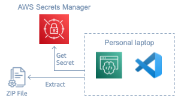
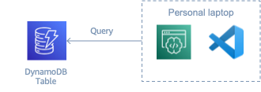
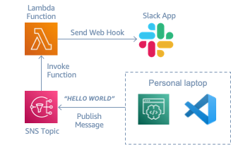

# Code Quest!

Welcome adventurers to the Code Quest ! You are an adventurer going on the quest to find some treasure and help some folks. The quest is quite challenging, but you got a companion named CodeWhisperer. You can use CodeWhisperer to help you conquest all the challenges coming ahead. You only have a weapons listed as below for your quest.

- **Tool:** Visual Studio Code
- **Companion:** CodeWhisperer

## Quest 1: Shine bright like a diamond!

You are on a quest to find a shiny diamond, hiding among the stones in a S3 bucket. You mission is to use Visual Studio Code to find the diamond in the bucket, download the diamond and show us the diamond.

- **S3 Bucket Name**: `cloudday-bkk-code-whisperer`
- **AWS Region**: `ap-southeast-1`

After finish writing the code, you can test the result using command below.

    python quest1-shine-bright-like-a-diamond/quest1.py

##### *Quest1 diagram*

## Quest 2: Bomb defuser

You are on a quest to defuse the bomb. The bomb is stored inside the zip file name `i-am-a-bomb.zip`. The getting the bomb is not easy task. You need a password to defuse the bomb. Your mission is to use Visual Studio Code to find the password to defuse the bomb. The password can be get from AWS Secrets Manager using GetSecretValue method to retrieve the password. After, retrieve the password, you can show us the bomb.

- **Secrets Manager Name**: `cloudday-bkk-defuser`
- **AWS Region**: `ap-southeast-1`
- **Bomb Zip file name**: `i-am-a-bomb.zip`

After finish writing the code, you can test the result using command below.

    python quest2-defuse-the-bomb/quest2.py

##### *Quest2 diagram*

## Quest 3: How old is Mr. Shiba?

You need to ask Mr.Shiba his age, but he is an introvert, so he talk less. Your mission is to find Shiba's age inside the provide dynamoDB using Visual Studio Code. You can use the information below to find Mr.Shiba age in animal kingdom table.

- **DynamoDB Table Name**: `animal-kingdom`
- **AWS Region**: `ap-southeast-1`
- **Key** : `name`
- **Value** : `shiba`

After finish writing the code, you can test the result using command below.

    python quest3-how-old-is-shiba/quest3.py

##### *Quest3 diagram*

## Quest 4: Translate alien's message

You have encounter with an alien's spaceship. The alien send you the message which you cannot understand. The message is sent in json but looks like this.

    "{\"message\": \"aovmywo*~y*Mvyn*Nkƒ*B~r7B\"}"

Your task is to translate what alien try to communicate. Luckly, we have a Lambda Function which can translate alien's message to human english. You can use Visual Studio Code to invoke Lambda function with message above to get the translated text. **Do not forget to decode the message to utf-8*

- **Lambda Function Name**: `alien-translator`
- **AWS Region**: `ap-southeast-1`
- **Payload** : `"{\"message\": \"aovmywo*~y*Mvyn*Nkƒ*B~r7B\"}"`

After finish writing the code, you can test the result using command below.

    python quest4-translate-alien-message/quest4.py

##### *Quest4 diagram*

## Quest 5: Hello World!

You send your greeting message to the world. We prepare a Slack Chanel so you can send your message to the world. It is very simple to send your message, just publish the message to provided SNS topic. The SNS topic will invoke a provided Lambda function which will send a web hook request the our Slack application. Pretty simple isn't it? Your mission is to publish any message you like to the SNS topics with the information as below.

- **SNS Topic ARN**: `arn:aws:sns:ap-southeast-1:638806779113:hello-world-topic`
- **AWS Region**: `ap-southeast-1`
- **Subject** : `Hello World`

After finish writing the code, you can test the result using command below.

    python quest4-hello-world/quest5.py

##### *Quest5 diagram*

