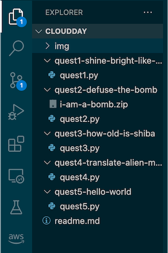
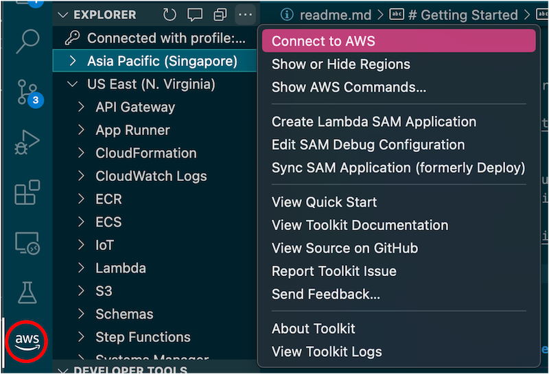
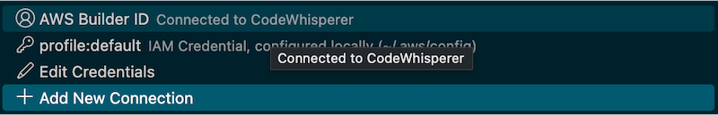
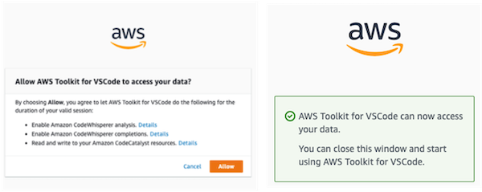
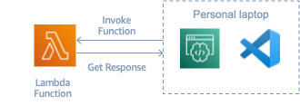

# Code Quest!


Welcome adventurers to the Code Quest ! You are an adventurer going on the quest to find some treasure and help some folks. The quest is quite challenging, but you got a companion named CodeWhisperer. You can use CodeWhisperer to help you conquest all the challenges coming ahead. You only have a weapons listed as below for your quest.

- **Tool:** Visual Studio Code
- **Companion:** CodeWhisperer

You will be on quest, solving problems using AWS services. There are totol of 5 quests listed as below.
The quest is not in sequential order, so you can do any one first.

- Quest 1: Shine bright like a diamond!
- Quest 2: Bomb defuser
- Quest 3: How old is Mr. Shiba?
- Quest 4: Translate alien's message
- Quest 5: Hello World!

# Prerequisite!

Here is the list of required resource you need before getting started.
- Visual Studio Code
- Git
- AWS CLI version 2
- Python 3.10.5 at least
- PIP3
- AWS boto3
- AWS Builder ID

## Visual Studio Code
You need **Visual Studio Code** to run this quest. If you do not have one, you can download it here. https://code.visualstudio.com/download 

## Git
You also need you Git to clone the repository in to your computer. You can download your git here.
https://git-scm.com/downloads 

## AWS CLI Version 2
You also need AWS CLI. Please download and get it ready!
https://docs.aws.amazon.com/cli/latest/userguide/getting-started-install.html 

After download you can run to check to version of AWS CLI. It should be at least *aws-cli/2.7.0*

```bash
aws --version
```

## Python3 and Pip3
You need Python3 to finish the quest. You can download it here. 
https://www.python.org/downloads/

After download you can run to check to version of Python3. It should be at least *3.10.x*

```bash
python3 --version
```

After you get Python3. Now install PIP3.

```bash
curl -O https://bootstrap.pypa.io/get-pip.py
python3 get-pip.py --user
```

Show your PIP version to verify that PIP is installed successfully.

```bash
pip3 --version
```

## AWS Boto3
Boto3 is the Amazon Web Services (AWS) Software Development Kit (SDK) for Python, which allows Python developers to write software that makes use of services like Amazon S3 and Amazon EC2. You can find the latest, most up to date, documentation at our doc site, including a list of services that are supported.

To install boto3, simply run this command to use pip to install boto3.

```bash
pip install boto3
```

You can learn more about boto3 and alternative way to install using this link.
https://pypi.org/project/boto3/ 

## AWS Builder ID

You can use Amazon CodeWhisperer for free with AWS Builder ID. To register new ID, please follow the step as below.
1. Go to https://profile.aws.amazon.com/
2. On the Create AWS Builder ID page, enter Your email address. We recommend that you use a personal email.
3. Choose Next.
4. Enter Your name, and then choose Next.
5. On the Email verification page, enter the verification code that we sent to your email address. Choose Verify. Depending on your email provider, it might take a few minutes for you to receive the email. Check your spam and junk folders for the code. If you don’t see the email from AWS after five minutes, choose Resend code.
6. After we verify your email, on the Choose a password page, enter a Password and Confirm password.
7. If a Captcha appears as additional security, enter the characters that you see.
8. Choose Create AWS Builder ID.

# Getting Started 

## Lab Setup

You are almost there. Now clone this repository and go inside the repository.

```bash
git clone https://github.com/WarotAsawa/code-quest.git
cd ./code-quest
```
Now, open your Visual Studio Code and open *code-quest* folder.
You will see all the directory.



## Install AWS Toolkit
Go to *Extension* Tab in Visual Studio Code and search for *AWS Toolkit*. Then install *AWS Toolkit* extension.


## Connect to AWS Accounts
After install AWS Toolhit extension. Click on AWS icon and three dots, then select connect to AWS.


Select *Edit Credential*


Then input AWS access key and secret key to default profile. Please contact author for the access and secret key.

```conf
[default]
aws_access_key_id= <please contact the author for key access>
aws_secret_access_key= <please contact the author for key access>
```

## Sign-in to AWS Builder ID
After install AWS Toolhit extension. Click on AWS icon and three dots, then select connect to AWS.


Click on *AWS Builder ID* 



Now click copy code, and VSCode will open the browser tab, then submit the code.


Now, login to your AWS Builder ID account. Click on *Allow* and now VSCode can use CodeWhisperer.



You can see at the bottom bar with check marks on *AWS:AWS Builder ID* and *CodeWhisperer*. Now, you are good to go!


# CloudQuest

## Quest 1: Shine bright like a diamond!


You are on a quest to find a shiny diamond, hiding among the stones in a S3 bucket. You mission is to use Visual Studio Code to find the diamond in the bucket, download the diamond and show us the diamond.

- **S3 Bucket Name**: `cloudday-bkk-code-whisperer`
- **AWS Region**: `ap-southeast-1`

After finish writing the code, you can test the result using command below.

```bash
python quest1-shine-bright-like-a-diamond/quest1.py
```

##### *Quest1 diagram*


## Quest 2: Bomb defuser


You are on a quest to defuse the bomb. The bomb is stored inside the zip file name `i-am-a-bomb.zip`. The getting the bomb is not easy task. You need a password to defuse the bomb. Your mission is to use Visual Studio Code to find the password to defuse the bomb. The password can be get from AWS Secrets Manager using GetSecretValue method to retrieve the password. After, retrieve the password, you can show us the bomb.

- **Secrets Manager Name**: `cloudday-bkk-defuser`
- **AWS Region**: `ap-southeast-1`
- **Bomb Zip file name**: `i-am-a-bomb.zip`

After finish writing the code, you can test the result using command below.
```bash
python quest2-defuse-the-bomb/quest2.py
```

##### *Quest2 diagram*


## Quest 3: How old is Mr. Shiba?


You need to ask Mr.Shiba his age, but he is an introvert, so he talk less. Your mission is to find Shiba's age inside the provide dynamoDB using Visual Studio Code. You can use the information below to find Mr.Shiba age in animal kingdom table.

- **DynamoDB Table Name**: `animal-kingdom`
- **AWS Region**: `ap-southeast-1`
- **Key** : `name`
- **Value** : `shiba`

After finish writing the code, you can test the result using command below.

```bash
python quest3-how-old-is-shiba/quest3.py
```

##### *Quest3 diagram*


## Quest 4: Translate alien's message


You have encounter with an alien's spaceship. The alien send you the message which you cannot understand. The message is sent in json but looks like this.
```json
"{\"message\": \"aovmywo*~y*Mvyn*Nkƒ*B~r7B\"}"
```
Your task is to translate what alien try to communicate. Luckly, we have a Lambda Function which can translate alien's message to human english. You can use Visual Studio Code to invoke Lambda function with message above to get the translated text. **Do not forget to decode the message to utf-8*

- **Lambda Function Name**: `alien-translator`
- **AWS Region**: `ap-southeast-1`
- **Payload** : `"{\"message\": \"aovmywo*~y*Mvyn*Nkƒ*B~r7B\"}"`

After finish writing the code, you can test the result using command below.

```bash
python quest4-translate-alien-message/quest4.py
```

##### *Quest4 diagram*



## Quest 5: Hello World!


You send your greeting message to the world. We prepare a Slack Chanel so you can send your message to the world. It is very simple to send your message, just publish the message to provided SNS topic. The SNS topic will invoke a provided Lambda function which will send a web hook request the our Slack application. Pretty simple isn't it? Your mission is to publish any message you like to the SNS topics with the information as below.

- **SNS Topic ARN**: `arn:aws:sns:ap-southeast-1:638806779113:hello-world-topic`
- **AWS Region**: `ap-southeast-1`
- **Subject** : `Hello World`

After finish writing the code, you can test the result using command below.
```bash
python quest5-hello-world/quest5.py
```

##### *Quest5 diagram*
